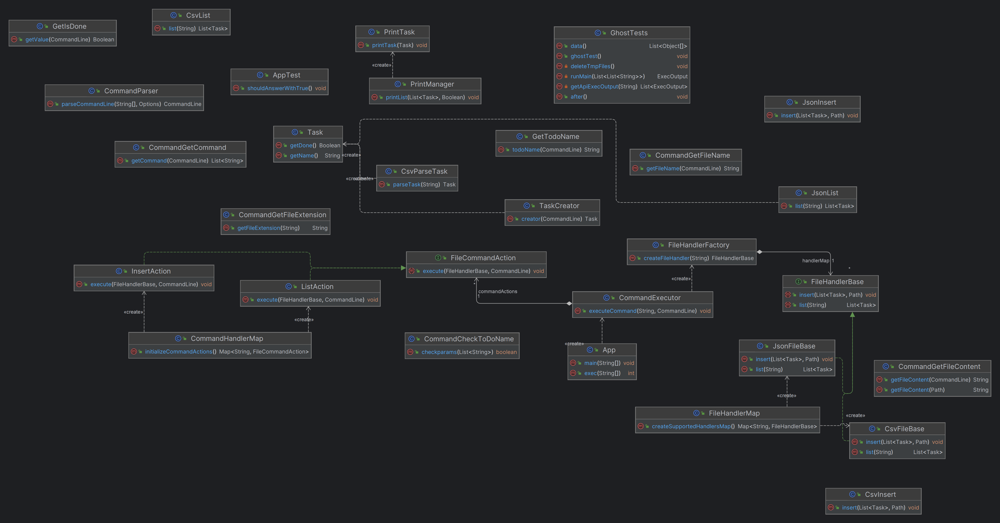

# L3 Design Pattern Report

- **Firstname**: [Nicolas]
- **Lastname**: [DODART]

> Add your thoughts on every practical session below; everything is interesting, but there's no need to write a book.
>
> Keep it short, simple, and efficient:
>
> - What you did and why
> - What helped you and why
> - What you found difficult
> - What did not help you
> - What you needed to change
> - Anything relevant
>
> Add a link to diagrams describing your architecture (UML or not but add a legend)
>
> Remember: it is ok to make mistakes, you will have time to spot them later.
>
> Feel free to contact me if needed.

---
...

# Practical Session Report

>## First Part
>> ### Introduction
>>For the first part of the practical session, I primarily focused on implementing the Single Responsibility Principle. I didn't encounter any particular difficulty in this task, as it's something I regularly practice when coding, given that I tend to think in a somewhat disorganized manner.
>>I also looked into two other areas:
>>- Coding a task as an object (Task class)
>>- Working on the command execution logic (CommandExecutor, FileHandlerFactory classes)
>
>>### Coding a Task as an Object
>>I worked on the Task class because I realized it was complicated to change the concept of a task without reworking the "complex / logical" part of the code. This meant I had to modify the insert and list operations to adapt them to the Task object concept. I managed to apply this concept to CSV files, but not for JSON files due to an issue with quotation marks (`"`), leading to the failure of the ghost test. (Resolved: it was just the starting and ending quotation marks in the output, I was able to add them "manually" during the print.)
>
>>### Working on the Command Execution Logic
>>Regarding the rework of the execution logic (CommandExecutor, FileHandlerFactory classes), it's because it seemed complicated to add a new type of file handling without getting bogged down in the execution logic of the code (a block of `if` and `else`). So, I worked on these classes with the idea of making this simpler.
>
>>### Difficulties
>>#### Inserts with Ghost Test
>>- I could not find the commands used for inserts during the Ghost Test.
>>#### File Storage
>>- In connection with the first point, I could not determine what the file storage looked like when the test succeeded.
>>#### Git Management
>>- Time lost due to incorrect use of Git.
>>
>#### Diagram of my program:
> ```mermaid
> classDiagram
>     class App {
>         +main(String[] args): void
>         +exec(String[] args): int
>     }
>     class CommandLineSettingsProvider {
>         +parseCommandLine(String[] args, Options cliOptions): CommandLine
>         +getFileName(CommandLine cmd): String
>         +getCommand(CommandLine cmd): List<String>
>         +getFileContent(Path filePath): String
>     }
>     class CommandExecutor {
>         +executeCommand(String fileName, String command, List<String> positionalArgs, String fileContent, Path filePath): void
>     }
>     class FileHandlerFactory {
>         +createFileHandler(String fileName): Optional<FileHandlerBase>
>     }
>     class FileHandlerBase {
>         +insert(List<String> positionalArgs, String fileName, String fileContent, Path filePath): void
>         +list(String fileContent): void
>     }
>     class CsvFileBase {
>         +isCsv(String fileName): boolean
>     }
>     class JsonFileBase {
>         +isJson(String fileName): boolean
>     }
>     App --|> CommandLineSettingsProvider
>     App --|> CommandExecutor
>     CommandExecutor --|> FileHandlerFactory
>     FileHandlerFactory --|> FileHandlerBase
>     FileHandlerBase <|.. CsvFileBase
>     FileHandlerBase <|.. JsonFileBase
> ```
---
>## Second Part
>>### Introduction
>>For the second part of the practical session, I focused on several points. Firstly, adding features requested by Ilia. This process was not very complicated as I had already created a Task object and adapted my Insert and List classes accordingly. It only required me to add a parameter in the Task class and in its initializations. During this process, I realized it can be taxing to change all the parameters that initialize the Task class. So, I created a TaskCreator class (separate from my Task class to keep it as simple as possible) where I take care of returning a task with the initialization parameters of the Task class (allows grouping the initialization parameters in a single central point)
>>### Task Management and Flexibility
>>To cover as many

eventualities and better manage my errors, I sent my command line directly into my Insert function rather than going through a list of positional arguments. This may be less optimal, but I think it offers more flexibility. Perhaps I should apply the same method to the List function?
>>### Reflection on Static Functions
>>I was also concerned about my numerous static functions. For this, I focused on the main functions of my program. I am thinking particularly of my CommandExecutor class, where it seems much easier to understand the code's operation with static functions.
>>### Test Management
>>At the time of this commit, I have left lists with a "-" if the `done == false` option so they always pass the ghost tests.
>
>#### Diagram of my program:
>  (for clarity, I simplified my CommandHandlers file into a single class excluding CommandExecutor which has, in my opinion, a greater responsibility)
>```mermaid
>classDiagram
>    class App {
>        +exec(String[] args): int
>        +main(String[] args): void
>    }
>    class TaskCreator {
>        +creator(CommandLine cmd): Task
>    }
>    class Task {
>        -String name
>        -Boolean done
>        +getName(): String
>        +getDone(): Boolean
>   }
>    class FileHandlerFactory {
>        +createFileHandler(String fileName): Optional<FileHandlerBase>
>    }
>    class FileHandlerBase {
>        +insert(String fileName, String fileContent, Path filePath, CommandLine cmd): void
>        +list(String fileContent): void
>    }
>    class JsonFileBase {
>        +isJson(String fileName): boolean
>    }
>    class CsvFileBase {
>        +isCsv(String fileName): boolean
>    }
>    class CommandExecutor {
>        +executeCommand(String fileName, String command, String fileContent, Path filePath, CommandLine cmd): void
>    }
>     class CommandHandlers {
>         +parseCommandLine(String[] args, Options cliOptions): CommandLine
>         +getFileName(CommandLine cmd): String
>         +getCommand(CommandLine cmd): List<String>
>         +getFileContent(Path filePath): String
>         +isList(String command): boolean
>         +isInsert(String command): boolean
>     }
>
>    Task<..TaskCreator
>    CsvFileBase <|-- TaskCreator
>    JsonFileBase <|-- TaskCreator
>    CommandExecutor --|> FileHandlerFactory
>    FileHandlerFactory --|> FileHandlerBase
>    FileHandlerBase <|.. JsonFileBase
>    FileHandlerBase <|.. CsvFileBase
>    App --|> CommandHandlers
>    CommandHandlers --|>CommandExecutor
>```
---

>## Third Part
> I started this third part by doing two things:
> adding a feature that I was not aware needed to be added (the -d on the list command)  
> correcting the list part of my program to match the output expected by the ghost test
> I modified the logic of my class FileHandlerFactory to make it much easier to implement new file types to manage.
> The goal is to ensure that files can be identified and instantiated dynamically based on the file name, without explicitly coding conditions for each type.
>
> I modified the logic of my functions (class CommandExecutor) using the same technique as for my FileHandlerFactory
>

>## Fourth Part
>
>### Introduction
>In this part of the work, the focus was on reusing and improving the insertion and listing functions to increase the program's flexibility. A significant overhaul of these functions was necessary to eliminate their direct interaction with the command line, resulting in better organization of program components and increased efficiency.
>
>### Modification of Insertion and Listing Functions
>The insertion (`CsvInsert/JsonInsert`) and listing functions were adjusted to work more abstractly. Rather than directly integrating command line parameters, these functions now only require a list of tasks and a file path (`filePath`). This change allowed for greater flexibility in using these functions across different parts of the program.
>
>### Overhaul of FileHandlerFactory
>An important change was made to `fileHandlerFactory`, which initially returned an `<Optional>` object in case of error. Now, it directly returns an error, thereby simplifying error case management and strengthening the program's robustness.
>
>### Implementation of the Migration Function
>The implementation of the migration function highlighted the importance of a well-organized program structure, where each class plays a specific role. This function required that direct interactions with the command line be limited to classes designed for this purpose (`CommandExecutor`, `InsertAction`, `ListAction`, `MigrationAction`), underscoring the importance of separation of concerns and adherence to the Single Responsibility Principle.
>
>### Conclusion
>This part of the work emphasized the importance of a flexible and well-structured program design.
>By adjusting the level of abstraction of the insertion and listing functions and clarifying the role of each class, the program became more robust, efficient, and easier to maintain. The successful implementation of the migration function served as a stress test, confirming the program structure's adequacy and the clarity of responsibilities within it.
>
> 
>
>### partie 4 bis:
> I modified the CommandAction class to only take the command line as a parameter, allowing for other types of actions besides file operations (new command types?), continuing the trend of my previous changes allowing more flexibility but also ensuring that each class has a more precise/comprehensible utility
> 
>
>#### Reflection on the different data sources:
> I think that in order to implement other data sources besides just files, it suffices to create code and management like file handling.
>
> There would be a `SourceHandlerFactory` that returns the appropriate class using a hashmap of the different sources and their corresponding factories:  
> if(File) -> FileHandlerFactory  
> if(Api) -> ApiHandlerFactory  
> It would then only be necessary to implement the important functions in an interface ( example for an API):  
> -public void sendTask(Task task)  
> -public void receiveTask()  
>


>### partie 5:
> tout d'abord j'ai modifié le paramêtre path de ma fonction insert dans mon fileHandler de path en String pour qu'il soit plus représentatif de ce qu'il est (je l'ai donc modifié en path plus bas dans mon application)
>j'ai ensuite abordé le problème de multigestion des sources,j'ai tenté plusieurs approche abstraite : (abstract factory ou par des facades)
> j'ai changé d'idée car la structure de mon programme rendais cela soit impossible soit trop compliqué (a mon sens)
> j'ai donc basé ma solution sur la partie de gestion des action de mon programme
> celui ci aurait une action pour chacun des type de source qu'il doit gérer. meme si cela enleve un niveau d'abstraction je pense que ca permet d'être plus précis dans ce que peut proposer chacun des types de stockage 
> (les principales modification ce situe au niveau de la class source identifier et de la class CommandHandlerMap)
> cela me permet aussi de gérer les nouvelle sources de la maniere dont j'ai envie et de créer "n'importe" qu'elle type de structure/interface
> 
> 
> 
> j'ai ensuite commencé a regarder pour faire la gestion web
> malgré une grande aide en nous fournissant le CrudProvider et le DummyCrudEnpoint
> pour être honnette , je n'ai pas compris ce que vous attendier de nous a ce niveau la,
> j'ai donc basé mon code sur les explications de sacha duviver .
> ce que fais mon programme ressemble a peut pres a ce que demande la consigne 
> a pas grand chose pres que je n'ai pas adapté ma task a ce qu'il y a dans l'exemple.
> n'étant pas sur de moi (j'ai l'impression d'avoir fais n'importe quoi), je n'ai pas pris le temps de faire un objet pour la commande web 
il y a un exemple de post dans le fichier zhttp.http